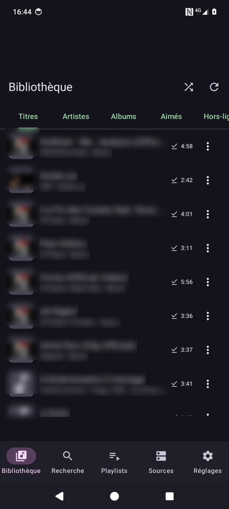
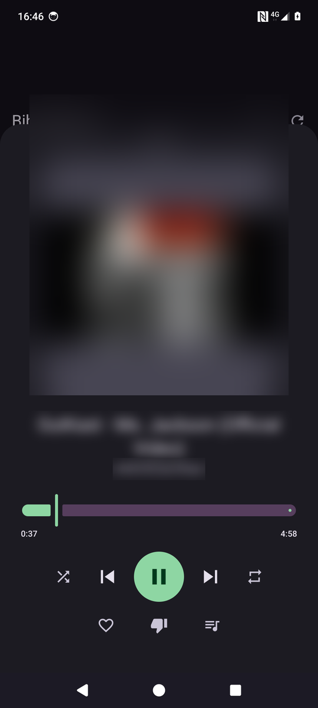
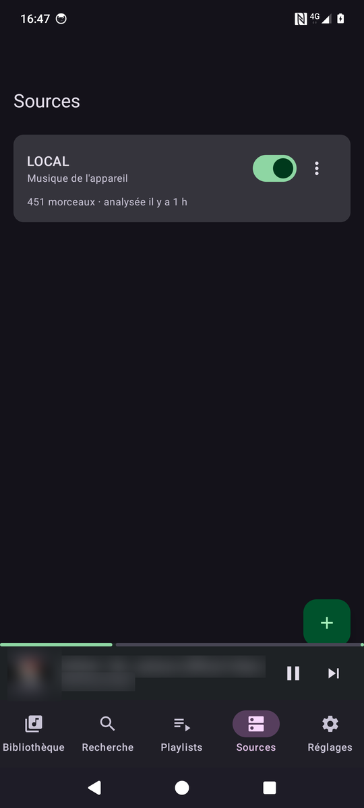
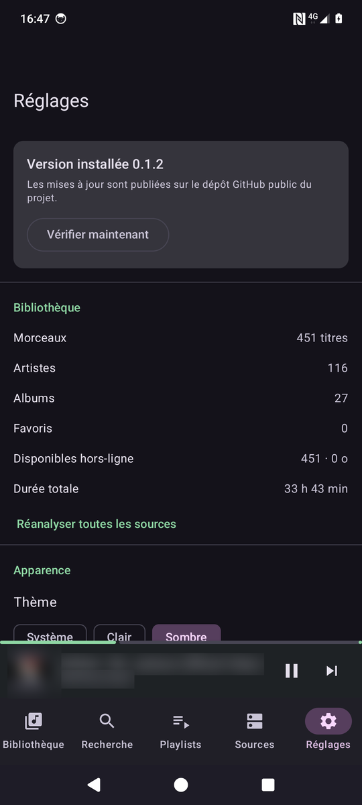

# Resonate

Lecteur de musique Android qui lit votre bibliothèque **là où elle est déjà** — un
serveur SSH, un NAS, un Nextcloud, un Navidrome — sans rien recopier, et qui sait la
rendre disponible hors-ligne quand vous le demandez.

[](https://github.com/micferna/resonate/actions/workflows/ci.yml)
[](https://github.com/micferna/resonate/actions/workflows/codeql.yml)
[](https://github.com/micferna/resonate/releases/latest)
[](LICENSE)

| Bibliothèque | Lecteur | Sources | Réglages |
|---|---|---|---|
|  |  |  |  |

<sub>Titres, artistes et pochettes floutés : ces captures montrent l'interface,
pas la discothèque de qui les a prises.</sub>

---

## Ce que ça fait

**Cinq façons de brancher votre musique**

| Source | Ce que ça couvre | Métadonnées |
|---|---|---|
| **Appareil** | La musique déjà sur le téléphone, via MediaStore. | Fournies par Android |
| **SFTP / SSH** | N'importe quel serveur SSH. Mot de passe ou clé privée. | Lues dans les fichiers |
| **SMB / CIFS** | Partages Windows, Samba, NAS Synology/QNAP. | Lues dans les fichiers |
| **WebDAV** | Nextcloud, ownCloud, Seafile, `mod_dav`. | Lues dans les fichiers |
| **Subsonic** | Navidrome, Airsonic, Gonic, Jellyfin. | Fournies par le serveur |

Les sources se cumulent : la musique du téléphone et celle de trois serveurs
cohabitent dans la même bibliothèque, les mêmes playlists et la même recherche.

**Android Auto**

- Bibliothèque parcourable depuis l'écran du véhicule : favoris, hors-ligne,
  playlists, artistes, albums, ajouts récents, plus écoutés.
- « Écoute … sur Resonate » dicté à l'Assistant.
- Appui sur Lecture au démarrage du véhicule : la file repart de la dernière
  écoute.
- Les listes se construisent uniquement depuis la base locale — aucune requête
  réseau ne fait patienter le conducteur devant un écran vide.

**Écoute**

- Lecture en arrière-plan, écran verrouillé, avec contrôles sur l'écran de
  verrouillage, le casque Bluetooth et les surfaces système.
- Accès aléatoire réel : se déplacer dans un morceau ne retélécharge pas ce qui
  précède, y compris en SFTP et en SMB.
- Cache de streaming borné, plus un espace hors-ligne épinglé qui n'est jamais
  évincé automatiquement.
- File de lecture réordonnable, aléatoire, répétition, **sauvegardée** : fermer
  l'app ne fait pas perdre sa place.
- **Reprise automatique** après une coupure réseau, avec des délais croissants.
  Un tunnel ou un NAS qui s'endort n'arrête plus la musique définitivement.
- **Égalisation du volume** entre morceaux d'après leur gain ReplayGain, et
  égaliseur système avec préréglages.
- **Minuterie d'arrêt**, à durée fixe ou à la fin du morceau en cours.

**Organisation**

- J'aime / je n'aime pas, avec saut automatique des morceaux rejetés.
- Playlists : création, réordonnancement, renommage, téléchargement en bloc.
- Recherche instantanée sur titre, artiste et album.
- Onglets Titres, Artistes, Albums, Aimés, Hors-ligne, Récents, Plus écoutés,
  Genres et Dossiers — l'arborescence des fichiers porte souvent une organisation
  que les tags ne reflètent pas.
- Tri des listes par artiste, titre, date d'ajout ou durée.
- Compteurs d'écoute et de saut, alimentés seulement au-delà de 30 secondes
  d'écoute réelle.

**Hors-ligne**

Un morceau rendu disponible hors-ligne est téléchargé par le gestionnaire de
Media3 : il reprend après une coupure, respecte la contrainte « Wi-Fi uniquement »,
survit à un redémarrage. Il est ensuite lu **par le même chemin de code** qu'un
morceau diffusé — il n'y a pas de mode hors-ligne séparé qui pourrait diverger.

**Autonomie**

Trois choix pèsent l'essentiel de la consommation, et ils sont assumés :

- La position de lecture n'est sondée que lorsqu'une interface la regarde. App
  fermée ou en pause, plus aucune boucle ne tourne.
- La mémoire tampon monte jusqu'à deux minutes d'avance. Chaque réveil de la
  radio coûte bien plus que les octets transférés : mieux vaut de longues rafales
  espacées qu'un filet continu.
- La lecture des tags se désarme d'elle-même une fois la file épuisée, au lieu de
  se réveiller toutes les vingt minutes pour constater qu'il n'y a rien à faire.

**Mises à jour**

L'app consulte les Releases de ce dépôt, prévient par notification, vérifie
l'empreinte SHA-256 publiée, puis passe la main au gestionnaire de paquets
d'Android. Rien ne s'installe sans votre confirmation explicite.

**Sauvegarde et transfert**

Les sauvegardes automatiques d'Android sont désactivées : elles ne
transporteraient que des secrets scellés par une clé propre à l'appareil, donc
illisibles ailleurs. **Réglages → Sauvegarde et transfert** exporte à la place un
fichier JSON contenant sources, playlists, appréciations et compteurs d'écoute,
réimportable sur un autre téléphone. Les secrets y sont en clair — c'est la seule
façon de les rendre transférables, et l'app le dit sans détour.

---

## Installation

1. Téléchargez le dernier `resonate-X.Y.Z.apk` depuis la
   [page des Releases](https://github.com/micferna/resonate/releases).
2. Vérifiez l'empreinte, publiée à côté de l'APK :
   ```bash
   sha256sum -c resonate-X.Y.Z.apk.sha256
   ```
3. Ouvrez le fichier sur votre téléphone et autorisez l'installation depuis cette
   source lorsque Android le demande.
4. Google Play Protect affichera « Appli bloquée pour protéger votre appareil ».
   C'est attendu : l'application est signée par une clé personnelle, inconnue de
   Google puisqu'elle n'est pas distribuée par le Play Store.

   La fenêtre ne propose d'abord qu'un bouton **OK**, qui annule l'installation.
   L'échappatoire est cachée derrière **Plus de détails** : le lien **Installer
   quand même** apparaît alors au bas du texte explicatif.

Les mises à jour suivantes se font depuis l'app, dans **Réglages → Mises à jour**.
L'app vérifie l'empreinte SHA-256 publiée avant d'installer quoi que ce soit, puis
laisse Android demander votre confirmation.

**Play Protect bloque aussi les mises à jour**, avec la même fenêtre et le même
détour par *Plus de détails*. Mesuré sur la mise à jour 0.2.2 → 0.2.3 : le
blocage n'a pas disparu parce que le certificat avait déjà servi. Attendez-vous
à refaire ce geste à chaque version tant que la clé reste inconnue de Google.

**Android 8.0 (API 26) minimum.** iOS n'est pas concerné : Apple interdit
l'installation d'applications hors de l'App Store, ce qui rend impossible le
mécanisme de mise à jour utilisé ici.

---

## Premiers pas

Ouvrez **Sources → +**, choisissez un protocole, remplissez les champs, puis
appuyez sur **Tester** avant d'enregistrer. Le test dit immédiatement si les
identifiants passent, plutôt que de vous laisser découvrir l'échec dans un
rapport d'indexation un quart d'heure plus tard.

Quelques repères selon le protocole :

- **SFTP** — la clé d'hôte du serveur est mémorisée à la première connexion et
  vérifiée ensuite, exactement comme le fait la commande `ssh`. Si elle change,
  la connexion est refusée jusqu'à ce que vous validiez le changement
  (menu de la source → *Oublier la clé d'hôte*).
- **SMB** — l'identifiant accepte `DOMAINE\utilisateur` comme `utilisateur@domaine`.
  Le nom du partage est celui qui suit `\\serveur\`.
- **WebDAV Nextcloud** — le dossier racine ressemble à
  `/remote.php/dav/files/votrecompte/Musique`. Un mot de passe d'application
  (Réglages Nextcloud → Sécurité) vaut mieux que votre mot de passe principal.
- **Subsonic** — le plus rapide à indexer : le serveur a déjà fait le travail,
  l'app récupère tags et pochettes sans ouvrir un seul fichier.

L'indexation démarre seule et écrit au fil de l'eau : la musique apparaît pendant
le balayage. Sur les sources de fichiers, les titres viennent d'abord du chemin
(`.../Artiste/Album/03 - Titre.flac` en dit déjà beaucoup), puis une tâche de fond
remplace ces valeurs par les vrais tags, morceau par morceau.

---

## Où vont vos identifiants

Les mots de passe et clés privées sont chiffrés en **AES-256-GCM** par une clé
générée dans le KeyStore matériel de l'appareil, non exportable. Une base de
données récupérée par une sauvegarde extraite, un `adb backup` ou un accès root
reste illisible ailleurs que sur ce téléphone.

Les sauvegardes automatiques d'Android sont désactivées pour cette raison : elles
ne transporteraient que des secrets indéchiffrables.

Les URI internes ne portent qu'une référence de source et un chemin
(`resonate://<id>/<chemin>`). Aucun identifiant ne transite par les clés de cache,
l'index des téléchargements ou les journaux.

---

## Compiler depuis les sources

Prérequis : JDK 17, SDK Android (plateforme 37, build-tools 36+).

```bash
git clone https://github.com/micferna/resonate.git
cd resonate
./gradlew assembleDebug          # APK de débogage
./gradlew testDebugUnitTest      # tests unitaires
./gradlew lintDebug              # analyse statique, avertissements = erreurs
```

### Compiler une version signée

Créez un magasin de clés — **conservez-le précieusement**, Android refuse de
mettre à jour une application avec un APK signé par une autre clé :

```bash
keytool -genkeypair -v -keystore resonate-release.jks -alias resonate \
        -keyalg RSA -keysize 4096 -validity 10950
```

Puis un `keystore.properties` à la racine (ignoré par git) :

```properties
storeFile=/chemin/absolu/resonate-release.jks
storePassword=…
keyAlias=resonate
keyPassword=…
```

```bash
./gradlew assembleRelease
```

### Publier une version

1. Mettez à jour `appVersionCode` et `appVersionName` dans `app/build.gradle.kts`.
2. Poussez un tag correspondant : `git tag v0.2.0 && git push origin v0.2.0`.

Le workflow *Release* vérifie que le tag correspond bien à la version compilée,
lance tests et analyse statique, produit l'APK signé, calcule son empreinte,
vérifie la signature, puis publie le tout. Un tag qui ne correspond pas à
`appVersionName` fait échouer le workflow — une Release annonçant une version que
l'APK ne porte pas ferait boucler l'updater des utilisateurs.

Secrets attendus par le dépôt :

| Secret | Contenu |
|---|---|
| `RESONATE_KEYSTORE_BASE64` | `base64 -w0 resonate-release.jks` |
| `RESONATE_KEYSTORE_PASSWORD` | mot de passe du magasin |
| `RESONATE_KEY_ALIAS` | alias de la clé |
| `RESONATE_KEY_PASSWORD` | mot de passe de la clé |

---

## Architecture

```
app/src/main/java/io/github/micferna/resonate/
├── source/       Sources de musique. Une source = une implémentation de
│                 SourceConnector : se tester, s'énumérer, se laisser lire en
│                 accès aléatoire. Tout le reste de l'app ignore le protocole.
│   ├── local/    MediaStore — la musique de l'appareil
│   ├── sftp/     sshj — vérification de clé d'hôte, multiplexage des canaux
│   ├── smb/      SMBJ — session partagée, lecture à décalage
│   ├── webdav/   PROPFIND profondeur 1 + GET avec en-tête Range
│   └── subsonic/ API REST, authentification par jeton salé
├── player/       Service Media3, arborescence Android Auto, double cache
│                 (streaming évincé / hors-ligne épinglé), téléchargements
├── data/         Room, chiffrement des identifiants, préférences, repositories
├── sync/         Indexation et résolution des tags en tâche de fond
├── update/       Releases GitHub, vérification d'empreinte, PackageInstaller
└── ui/           Compose, Material 3, couleurs dynamiques
```

Le point d'articulation est `ResonateDataSourceFactory` : il aiguille chaque URI
`resonate://` vers le connecteur de sa source. En amont, file de lecture, cache,
téléchargements et extraction de tags ne manipulent qu'un seul type d'URI.
**Ajouter un protocole revient à écrire un `SourceConnector` et à l'enregistrer
dans `SourceModule`** ; rien d'autre ne change.

### Choix notables

- **Deux caches, pas un.** Le cache de streaming vit dans `cacheDir`, borné et
  évincé en LRU — Android peut le vider. Le cache hors-ligne vit dans `filesDir`
  et n'évince jamais rien. Les mélanger laisserait l'éviction effacer
  silencieusement de la musique téléchargée exprès.
- **Identifiants de morceaux déterministes**, dérivés de la source et du chemin.
  Ré-indexer retrouve les lignes existantes : likes, compteurs et playlists
  survivent au renommage d'un dossier.
- **Ré-indexation non destructive.** Les sources publiant des tags faisant
  autorité voient leurs métadonnées rafraîchies ; les autres ne voient mettre à
  jour que leur présence, pour ne pas écraser des tags déjà extraits par une
  déduction tirée du chemin.

---

## Qualité et sécurité de la chaîne

- **CI** sur chaque poussée : tests, Lint en mode `warningsAsErrors`, compilation.
- **Aucun fichier de référence Lint** : les problèmes sont corrigés, pas mis de
  côté. Les deux seules exceptions sont dans `app/lint.xml`, chacune justifiée.
- **CodeQL** hebdomadaire sur le code Kotlin.
- **Dependabot** sur les dépendances Gradle et les actions GitHub.
- Le wrapper Gradle est épinglé par empreinte SHA-256 et validé en CI.
- Les versions de BouncyCastle sont explicitement relevées au-dessus de celles
  qu'apportent sshj et SMBJ.

---

## Limites connues

- **Android uniquement.** Le mécanisme de mise à jour repose sur l'installation
  d'APK, impossible sur iOS.
- **Pas de fondu enchaîné** : ExoPlayer ne le propose pas, l'obtenir demande deux
  lecteurs ou un processeur audio maison.
- **Pas de paroles**, pas de scrobbling, pas de Chromecast, pas de widget.
- **Android Automotive OS** (le système embarqué directement dans certains
  véhicules, sans téléphone) n'est pas ciblé : il demande une variante de build
  distincte. Android Auto — la projection depuis le téléphone, de loin la plus
  répandue — est pris en charge.
- **NFS non pris en charge.** Android ne permet pas de monter un partage NFS sans
  root ; il faudrait embarquer un client NFS en espace utilisateur. Un serveur
  SFTP ou Samba sur la même machine est le contournement habituel.
- La recherche utilise `LIKE` sur une clé normalisée plutôt qu'un index de
  recherche plein texte. Suffisant jusqu'à quelques dizaines de milliers de
  titres.

---

## Licence

MIT — voir [LICENSE](LICENSE).
